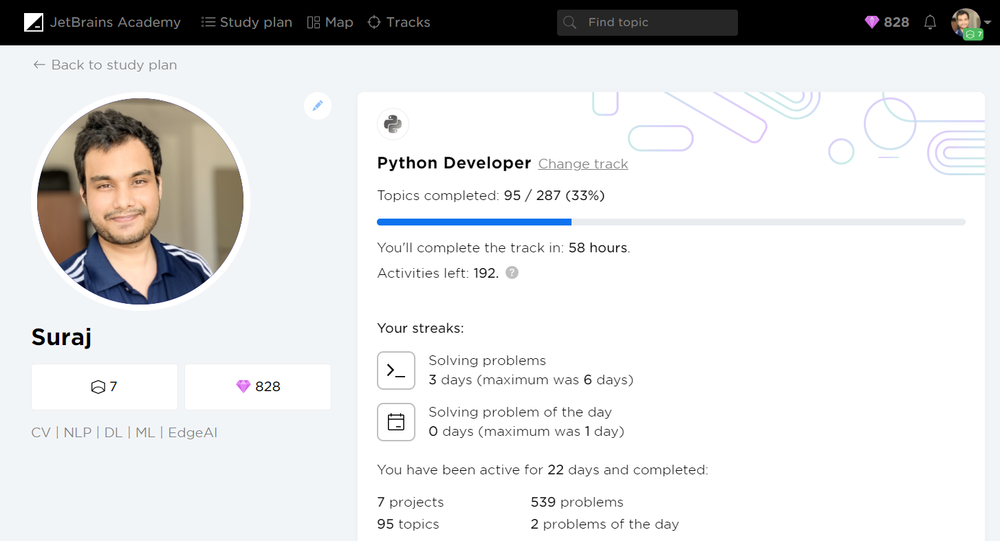

# About the Repo

> > This repo contains source code of various projects available in the Python Developer Track of JetBrains Academy.
    Link to the Python Developer Track: https://hyperskill.org/tracks/2

- <a href="https://github.com/Suraj520/Python_developer_track/tree/master/Coffee%20Machine"> Coffee Machine </a>
- <a href="https://github.com/Suraj520/Python_developer_track/tree/master/Hangman"> Hangman </a>
- <a href="https://github.com/Suraj520/Python_developer_track/tree/master/Loan%20Calculator"> Loan Calculator </a>
- <a href="https://github.com/Suraj520/Python_developer_track/tree/master/Simple%20Banking%20System"> Simple Banking System </a>
- <a href="https://github.com/Suraj520/Python_developer_track/tree/master/Simple%20Chatty%20Bot"> Simple Chatty Bot </a>
- <a href="https://github.com/Suraj520/Python_developer_track/tree/master/Tic-Tac-Toe"> Tic Tac Toe </a>
- <a href="https://github.com/Suraj520/Python_developer_track/tree/master/Zookeeper"> Zoo Keeper </a>
- <a href="https://github.com/Suraj520/Python_developer_track/tree/master/To-Do%20List"> To-Do List </a>
- <a href="https://github.com/Suraj520/Python_developer_track/tree/master/Numeric%20Matrix%20Processor"> Numeric Matrix Processor </a>
- <a href="https://github.com/Suraj520/Python_developer_track/tree/master/Rock-Paper-Scissors"> Rock Paper Scissors </a>
- <a href="https://github.com/Suraj520/Python_developer_track/tree/master/Text-Based%20browser"> Text-Based browser </a> 
-  <a href="https://github.com/Suraj520/Python_developer_track/tree/master/Easy%20Rider%20Bus%20Companyr"> Easy Rider Bus Company </a>

